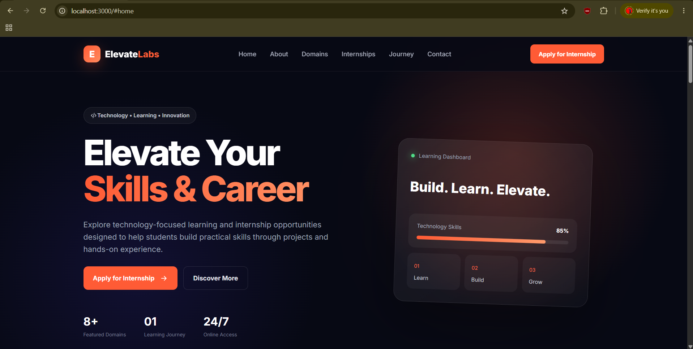
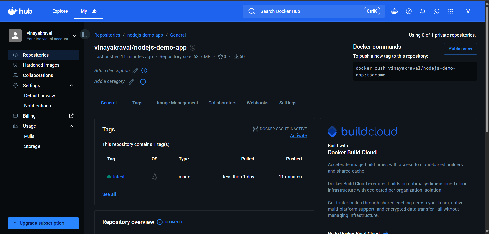
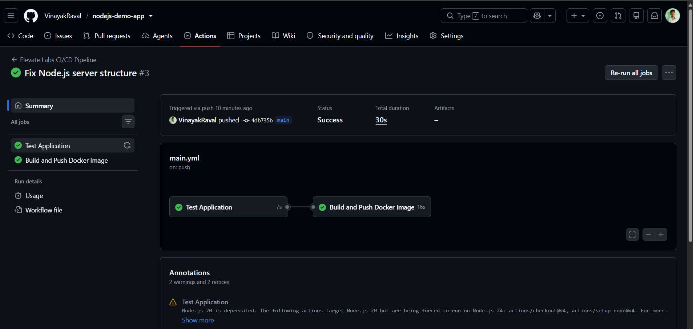

# Elevate Labs DevOps Internship --- Task 1

## CI/CD Pipeline for a Node.js Application using GitHub Actions and Docker

This project was developed as part of the **Elevate Labs DevOps
Internship -- Task 1**.

The objective is to create a CI/CD pipeline for a Node.js web
application using **Node.js, Express.js, GitHub, GitHub Actions, Docker,
and Docker Hub**.

The pipeline automatically runs tests, builds a Docker image, and pushes
the image to Docker Hub whenever code is pushed to the `main` branch.

------------------------------------------------------------------------

## 1. Project Objective

This project demonstrates an automated CI/CD workflow:

``` text
Developer
   |
   | git push origin main
   v
GitHub Repository
   |
   v
GitHub Actions
   |
   +--> Checkout Code
   |
   +--> Setup Node.js
   |
   +--> Install Dependencies
   |
   +--> Run Tests
   |
   +--> Build Docker Image
   |
   +--> Login to Docker Hub
   |
   +--> Push Docker Image
   |
   v
Docker Hub
```

------------------------------------------------------------------------

## 2. About the Application

The application is a professional informational web application created
around the **Elevate Labs DevOps internship/project context**.

It contains information related to: - Elevate Labs - Internship
opportunities - Technology domains - DevOps - Web Development - Python -
Java - SQL - AI/ML - Cyber Security - Data Analytics - Internship
journey - Application/contact information

This is an **independent educational/demo project** and is not the
official Elevate Labs website.

------------------------------------------------------------------------

## 3. Technologies Used

  Technology       Purpose
  ---------------- ------------------------
  Node.js          Backend runtime
  Express.js       Web server framework
  HTML             Web page structure
  CSS              Website styling
  JavaScript       Frontend interaction
  Git              Version control
  GitHub           Source code repository
  GitHub Actions   CI/CD automation
  Docker           Containerization
  Docker Hub       Docker image registry

------------------------------------------------------------------------

## 4. Project Structure

``` text
nodejs-demo-app/
│
├── .github/
│   └── workflows/
│       └── main.yml
│
├── public/
│   ├── index.html
│   ├── style.css
│   └── script.js
│
├── screenshots/
│   ├── 01-application-running.png
│   ├── 02-docker-hub.png
│   ├── 03-workflow-steps.png
│   ├── 04-github-actions-Test-success.png
│   └── 05-github-actions-build-success.png
│
├── test/
│   └── health.test.js
│
├── app.js
├── server.js
├── package.json
├── package-lock.json
├── Dockerfile
├── .dockerignore
└── README.md
```

------------------------------------------------------------------------

## 5. How the Application Works

`app.js` creates and configures the Express application.

It: 1. Creates the Express application. 2. Enables JSON requests. 3.
Serves the frontend from the `public` folder. 4. Provides a health-check
API. 5. Exports the application for testing and server startup.

The health-check endpoint is:

``` text
GET /api/health
```

Example response:

``` json
{
  "status": "healthy",
  "application": "Elevate Labs Information Portal"
}
```

`server.js` starts the HTTP server and listens on port `3000`.

------------------------------------------------------------------------

## 6. Starting the Application Locally

### Step 1 --- Open the project

Open `nodejs-demo-app` in VS Code.

### Step 2 --- Install dependencies

``` bash
npm install
```

### Step 3 --- Run automated tests

``` bash
npm test
```

The test verifies that the health API works correctly.

### Step 4 --- Start the Node.js server

``` bash
npm start
```

The application runs at:

``` text
http://localhost:3000
```

### Step 5 --- Open the application

Open:

``` text
http://localhost:3000
```

### Step 6 --- Check the health API

Open:

``` text
http://localhost:3000/api/health
```

Expected response:

``` json
{
  "status": "healthy",
  "application": "Elevate Labs Information Portal"
}
```

To stop a locally running Node.js server in the terminal, press:

``` text
Ctrl + C
```

------------------------------------------------------------------------

## 7. Automated Testing

The project contains:

``` text
test/health.test.js
```

The test checks: - The application starts successfully. - `/api/health`
is accessible. - HTTP status is `200`. - The response status is
`healthy`.

Run locally:

``` bash
npm test
```

The same test is automatically executed by GitHub Actions before the
Docker image is built.

------------------------------------------------------------------------

## 8. Docker

The application is containerized using Docker.

The Dockerfile: 1. Uses Node.js Alpine as the base image. 2. Sets `/app`
as the working directory. 3. Copies `package.json` and
`package-lock.json`. 4. Installs production dependencies. 5. Copies the
application files. 6. Exposes port `3000`. 7. Starts the application
using `npm start`.

### Build the image

``` bash
docker build -t nodejs-demo-app .
```

### Run the container

``` bash
docker run -d -p 3000:3000 --name elevate-labs-app nodejs-demo-app
```

Open:

``` text
http://localhost:3000
```

Check the container:

``` bash
docker ps
```

Stop it:

``` bash
docker stop elevate-labs-app
```

Remove it:

``` bash
docker rm elevate-labs-app
```

------------------------------------------------------------------------

## 9. Docker Hub

The Docker image is:

``` text
vinayakraval/nodejs-demo-app:latest
```

Pull the image:

``` bash
docker pull vinayakraval/nodejs-demo-app:latest
```

Run the pulled image:

``` bash
docker run -d -p 3000:3000 --name elevate-labs-app vinayakraval/nodejs-demo-app:latest
```

------------------------------------------------------------------------

## 10. GitHub Actions CI/CD Pipeline

The workflow is located at:

``` text
.github/workflows/main.yml
```

It is triggered when code is pushed to `main`:

``` yaml
on:
  push:
    branches:
      - main
```

### Job 1 --- Test Application

The test job: 1. Checks out the code. 2. Sets up Node.js. 3. Installs
dependencies with `npm ci`. 4. Runs `npm test`.

### Job 2 --- Build and Push Docker Image

This job runs only after the test job succeeds.

It: 1. Checks out the code. 2. Logs in to Docker Hub. 3. Builds the
Docker image. 4. Pushes the image to Docker Hub.

The dependency is:

``` yaml
needs: test
```

Therefore:

``` text
Test
  |
  | Success
  v
Docker Build
  |
  v
Docker Push
```

------------------------------------------------------------------------

## 11. GitHub Secrets

Docker Hub credentials are stored as GitHub repository secrets:

``` text
DOCKERHUB_USERNAME
DOCKERHUB_TOKEN
```

The workflow uses:

``` yaml
${{ secrets.DOCKERHUB_USERNAME }}
```

and:

``` yaml
${{ secrets.DOCKERHUB_TOKEN }}
```

The credentials are not written directly into the source code.

The Docker Hub token needs permission to push the image.

------------------------------------------------------------------------

## 12. Complete CI/CD Flow

``` text
1. Write or modify application code
          |
          v
2. git add .
          |
          v
3. git commit
          |
          v
4. git push origin main
          |
          v
5. GitHub Actions starts
          |
          v
6. Checkout Code
          |
          v
7. Setup Node.js
          |
          v
8. npm ci
          |
          v
9. npm test
          |
          v
10. Docker Build
          |
          v
11. Docker Hub Login
          |
          v
12. Docker Push
          |
          v
13. Docker image available on Docker Hub
```

------------------------------------------------------------------------

## 13. Git Commands Used

Check repository status:

``` bash
git status
```

Add changes:

``` bash
git add .
```

Commit changes:

``` bash
git commit -m "Update application and CI/CD pipeline"
```

Push changes:

``` bash
git push origin main
```

Check branch:

``` bash
git branch
```

View commits:

``` bash
git log --oneline
```

------------------------------------------------------------------------

## 14. What I Implemented

For this task, I:

-   Created a Node.js and Express web application.
-   Created the Elevate Labs informational frontend.
-   Added a health-check API.
-   Added an automated Node.js test.
-   Separated the Express app from server startup.
-   Created a Dockerfile.
-   Created a `.dockerignore` file.
-   Built the Docker image locally.
-   Tested the application using Docker.
-   Created and configured the GitHub repository.
-   Created `.github/workflows/main.yml`.
-   Configured the workflow to run on pushes to `main`.
-   Added automated testing to GitHub Actions.
-   Added Docker image build automation.
-   Added Docker Hub authentication using GitHub Secrets.
-   Added Docker image push automation.
-   Pushed the image to Docker Hub.
-   Pulled the image from Docker Hub.
-   Ran the pulled image as a Docker container.
-   Verified the application on port `3000`.

------------------------------------------------------------------------

## 15. Local Testing vs CI/CD Testing

### Local

``` bash
npm install
npm test
npm start
```

Then open:

``` text
http://localhost:3000
```

### CI/CD

``` text
Checkout
   |
Node.js Setup
   |
npm ci
   |
npm test
   |
Docker Build
   |
Docker Hub Login
   |
Docker Push
```

------------------------------------------------------------------------

## 16. Screenshots

### 1. Application Running

This shows the completed application running locally.



### 2. Docker Hub

This shows the Docker image available on Docker Hub.



### 3. GitHub Actions Workflow Steps

This shows the workflow steps executed by GitHub Actions.



### 4. GitHub Actions Test Success

This shows the successful automated test stage.


### 5. GitHub Actions Build Success

This shows the successful Docker build/push stage.


------------------------------------------------------------------------

## 17. Additional Screenshots Recommended

Your current `screenshots` folder contains five screenshots. For a more
complete submission, you can also add:

``` text
06-github-repository.png
07-project-structure.png
08-main-yml.png
```

Then add them to this section:

``` markdown
### 6. GitHub Repository


### 7. Project Structure


### 8. GitHub Actions Workflow File


```

------------------------------------------------------------------------

## 18. Docker and GitHub Actions Relationship

### Docker

Docker packages the application into a container image:

``` text
Node.js Application
       |
       v
   Docker Image
       |
       v
 Docker Container
```

### GitHub Actions

GitHub Actions automates the CI/CD process:

``` text
Git Push
   |
   v
GitHub Actions
   |
   +--> Test
   |
   +--> Docker Build
   |
   +--> Docker Push
```

Together they provide an automated workflow for testing, building, and
publishing the application.

------------------------------------------------------------------------

## 19. Important Commands

Start application:

``` bash
npm start
```

Run tests:

``` bash
npm test
```

Build Docker image:

``` bash
docker build -t nodejs-demo-app .
```

Run Docker container:

``` bash
docker run -d -p 3000:3000 --name elevate-labs-app nodejs-demo-app
```

Pull Docker Hub image:

``` bash
docker pull vinayakraval/nodejs-demo-app:latest
```

Check containers:

``` bash
docker ps
```

Stop container:

``` bash
docker stop elevate-labs-app
```

Git status:

``` bash
git status
```

Push changes:

``` bash
git add .
git commit -m "Update project"
git push origin main
```

------------------------------------------------------------------------

## 20. Repository

GitHub repository:

https://github.com/VinayakRaval/nodejs-demo-app

Docker Hub image:

``` text
vinayakraval/nodejs-demo-app:latest
```

------------------------------------------------------------------------

## 21. Elevate Labs Application Link

The application/internship page used for the project information and
application CTA is:

https://elevatelabs.in/apply-for-internship/

------------------------------------------------------------------------

## 22. Author

**Vinayak Raval**

GitHub:

https://github.com/VinayakRaval

------------------------------------------------------------------------

## 23. Task Summary

This project demonstrates a basic end-to-end CI/CD implementation for a
Node.js application:

``` text
Node.js Application
       |
       v
     GitHub
       |
       v
 GitHub Actions
       |
       +----> Automated Tests
       |
       +----> Docker Build
       |
       +----> Docker Hub Push
       |
       v
 Docker Hub Image
       |
       v
 Docker Container
       |
       v
 Running Web Application
```

The project demonstrates practical use of **Git, GitHub, GitHub Actions,
Node.js, Express.js, Docker, Docker Hub, automated testing, and CI/CD
concepts**.

------------------------------------------------------------------------

## Disclaimer

This is an independent educational and internship project created for
demonstration purposes.

It is not the official Elevate Labs website.
